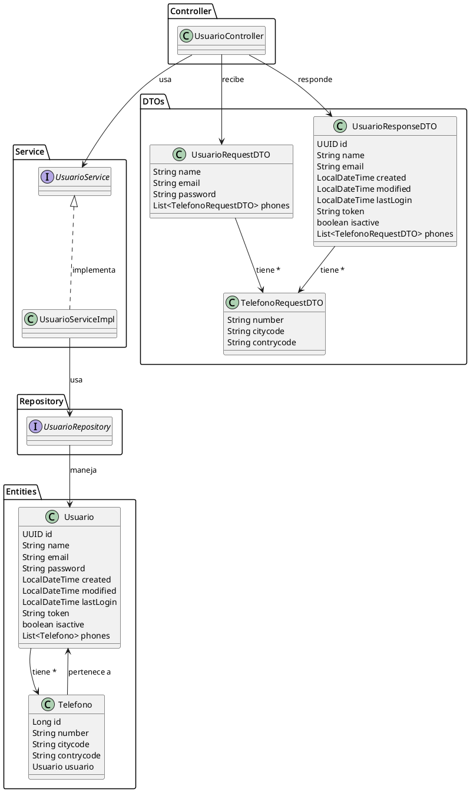
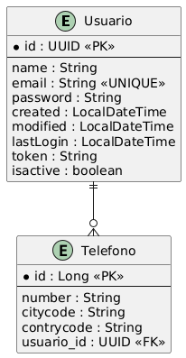

# ms-usuarios

Microservicio de gestión de usuarios desarrollado en Spring Boot. Permite la creación y consulta de usuarios, almacenando información personal y teléfonos asociados. Incluye autenticación JWT y documentación Swagger/OpenAPI.

## Descripción de la solución

La solución implementa una arquitectura típica de microservicio en Java con Spring Boot, separando responsabilidades en controladores, servicios, repositorios, entidades y DTOs. El flujo principal es:

- **UsuarioController**: expone los endpoints REST para crear y consultar usuarios.
- **UsuarioService**: define la lógica de negocio para la gestión de usuarios.
- **UsuarioRepository**: maneja la persistencia de usuarios en la base de datos.
- **Entidades y DTOs**: representan los datos de dominio y los objetos de transferencia.

### Diagrama de la solución



## Modelo de base de datos

El modelo de datos está compuesto por dos entidades principales:

- **Usuario**: contiene los datos personales, credenciales y metadatos de sesión.
- **Telefono**: almacena los números de teléfono asociados a cada usuario.

Relación: Un usuario puede tener varios teléfonos, y cada teléfono pertenece a un usuario.

### Diagrama de la base de datos



## Endpoints y ejemplos de uso (curl)

### Crear usuario

```bash
curl -X POST http://localhost:8080/api/usuarios \
  -H "Content-Type: application/json" \
  -d '{
    "name": "Juan Perez",
    "email": "juan@mail.com",
    "password": "123456",
    "phones": [
      { "number": "123456789", "citycode": "1", "contrycode": "56" }
    ]
  }'
```

### Obtener todos los usuarios

```bash
curl -X GET http://localhost:8080/api/usuarios
```

## Documentación Swagger

La documentación interactiva de la API está disponible en:

- http://localhost:8080/swagger-ui.html
- http://localhost:8080/swagger-ui/index.html

## Notas

- El microservicio utiliza una base de datos H2 en memoria para pruebas y desarrollo.
- El modelo y la solución pueden ser extendidos fácilmente para nuevas funcionalidades.

